# Game-ARC dataset

This is a growing collection of my custom tasks designed for the ARC challenge, in the same format as the ARC-AGI 1 and 2 datasets. Most of the riddles are derived from various digital and analog games such as Tic-Tac-Toe, Sudoku, Match Four, and Flappy Bird - hence the name Game-ARC.

## List of tasks

| #                 | Title                | Train | Test | Preview                                      |
| ----------------- | -------------------- | ----- | ---- | -------------------------------------------- |
| [001](./001.json) | Labyrinth            | 4     | 2    | 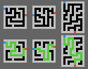            |
| [002](./002.json) | Portal               | 5     | 3    | 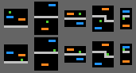               |
| [003](./003.json) | Tic Tac Toe          | 3     | 2    | 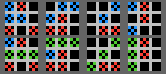          |
| [004](./004.json) | Breakout             | 4     | 2    | 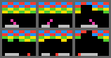             |
| [005](./005.json) | Sudoku               | 3     | 2    | 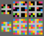               |
| [006](./006.json) | Tetromino Puzzle     | 3     | 2    | 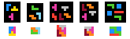     |
| [007](./007.json) | Match 3              | 5     | 2    | 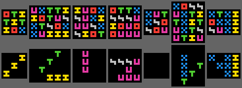              |
| [008](./008.json) | Math                 | 4     | 2    | 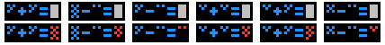                 |
| [009](./009.json) | Spot The Difference  | 4     | 2    | 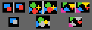  |
| [010](./010.json) | Railway              | 3     | 2    | 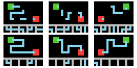              |
| [011](./011.json) | Falling Sand         | 4     | 2    | 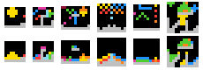         |
| [012](./012.json) | Flappy Bird          | 3     | 2    | 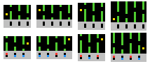          |
| [013](./013.json) | Match Four           | 3     | 2    | 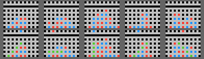           |
| [014](./014.json) | Match 5              | 5     | 2    | 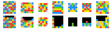              |
| [015](./015.json) | Find Pairs           | 3     | 2    | 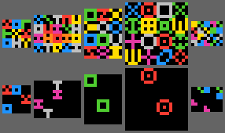           |
| [016](./016.json) | Mikado               | 3     | 3    | 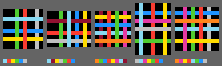               |
| [017](./017.json) | Look And Find        | 3     | 2    | 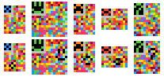        |
| [018](./018.json) | Connect The Dots     | 4     | 2    | 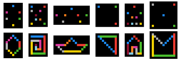     |
| [019](./019.json) | Coloring Book        | 3     | 2    | 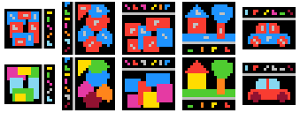        |
| [020](./020.json) | Puzzle               | 3     | 2    | 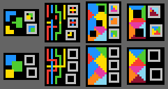               |
| [021](./021.json) | Laser Mirrors        | 3     | 2    | 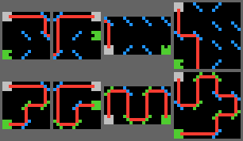        |
| [022](./022.json) | Balance The Scale    | 3     | 2    | 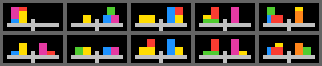    |
| [023](./023.json) | Shape Puzzle         | 3     | 2    | 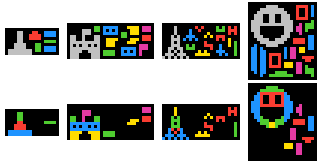         |
| [024](./024.json) | Sand And Water       | 4     | 2    | 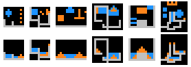       |
| [025](./025.json) | Connect Colors       | 4     | 3    | 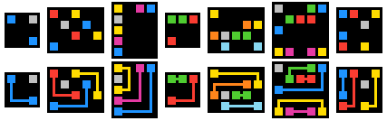       |
| [026](./026.json) | Highway Crossing     | 4     | 2    | 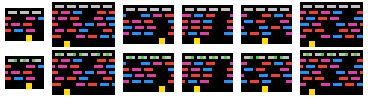     |
| [027](./027.json) | Board Game           | 4     | 2    | 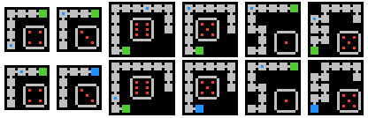           |
| [028](./028.json) | Ordering             | 4     | 2    | 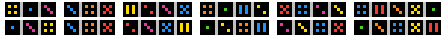             |
| [029](./029.json) | Continue The Pattern | 5     | 2    | 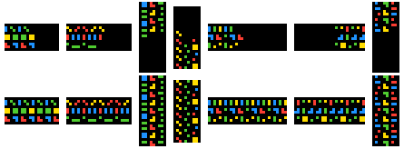 |
| [030](./030.json) | Snakes And Ladders   | 5     | 2    | 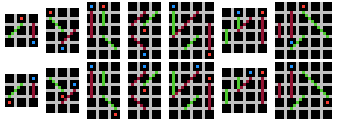   |
| [031](./031.json) | Slot Machine         | 6     | 3    | 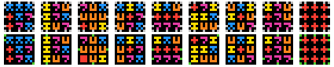         |
| [032](./032.json) | Space Invaders       | 4     | 2    | 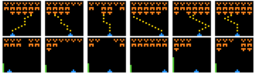       |
| [033](./033.json) | Lemmings             | 4     | 3    | 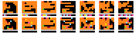             |

### Text descriptions

| #                 | Title                | Description |
| ----------------- | -------------------- | ----------- |
| [001](./001.json) | Labyrinth            | Find the shortest path between red and blue, and mark it with green. |
| [002](./002.json) | Portal               | Follow the path of the green dot falling through the blue and orange portals. |
| [003](./003.json) | Tic Tac Toe          | Find the winning move for the blue player and highlight the 3 in a row with green. |
| [004](./004.json) | Breakout             | Purple marks the launch direction of the ball. Follow its path, remove the bricks on the way, and change direction on every hit, including the sides. Mark where the ball finally hit the bottom with red. |
| [005](./005.json) | Sudoku               | Place the available colors so that every row, column, and region has only one of each. |
| [006](./006.json) | Tetromino Puzzle     | Put the available pieces into a perfect rectangle. No rotation allowed. |
| [007](./007.json) | Match 3              | Delete each sign except the ones where 3 are in a row, column, or diagonal line. |
| [008](./008.json) | Math                 | Add or subtract the number of dots and put your answer with red in the place of the gray area, following the pattern of the others. |
| [009](./009.json) | Spot The Difference  | Compare the images. Leave only the right one, and recolor every object to gray that changed position. |
| [010](./010.json) | Railway              | Put the needed rail pieces into position so that the two stations are connected. |
| [011](./011.json) | Falling Sand         | Follow the path of the colored sand grains. They stack on the ground (gray) and each other, but also spread when a column is higher than one grain. |
| [012](./012.json) | Flappy Bird          | The bird is yellow, and the pipes are green. Place the required inputs (up or down) in order to holes at the bottom (top red pixel for up, bottom blue pixel for down) so that the bird can move across the pipes. Shift the screen to the left 2 units, and move the bird to the end, one pixel higher from where it started. |
| [013](./013.json) | Match Four           | Find the winning move, and place a red or blue in the top row so that it falls to the right place. Highlight the 4 in a row with green. |
| [014](./014.json) | Match 5              | Remove every 5 in a row, then apply gravity to the remaining pixels. Repeat until all matches are removed. |
| [015](./015.json) | Find Pairs           | Remove all unique symbols. |
| [016](./016.json) | Mikado               | Draw a single horizontal strip of colors (left to right) in the right order to remove the sticks from the pile. |
| [017](./017.json) | Look And Find        | Find and remove the highlighted pixel formation from the noisy image. |
| [018](./018.json) | Connect The Dots     | Connect the dots with horizontal, vertical or diagonal lines in the order of the colors. The last color connects back to the first if possible. |
| [019](./019.json) | Coloring Book        | Color each region based on the gray sign on them. The meaning of the signs are shown in a separate area. Change the ones to gray which are absent from the image. |
| [020](./020.json) | Puzzle               | Place the puzzle pieces to place to fill in the missing areas. |
| [021](./021.json) | Laser Mirrors        | Rotate the blue mirrors in 90 degrees so that the red laser ends up in the green catcher. Mark the mirrors green which you adjusted, and update the path of the laser. |
| [022](./022.json) | Balance The Scale    | Move the blocks so that both sides of the scale have the same weight. |
| [023](./023.json) | Shape Puzzle         | Place the pieces into the gray shadow so that it is completely filled. Leave the unused pieces in their original positions, |
| [024](./024.json) | Sand And Water       | Orange is sand, blue is water, and gray is concrete. Water flows, sand sinks and piles. Follow the path of them and show the final state. |
| [025](./025.json) | Connect Colors       | Connect the squares with the same color, without lines crossing a gray area or each other. Always use the shortest path and turn as few times as possible, but follow the grid. |
| [026](./026.json) | Highway Crossing     | Place a green pixel to the gray triplets to help the frog cross the highway upwards. Place it left for moving left, center to only move forward, and right to move right. |
| [027](./027.json) | Board Game           | Move with the blue dot towards the green goal as many places as shown on the dice. If you end up in the goal, change its color to blue. |
| [028](./028.json) | Ordering             | Reorder the dices from left to right in increasing order of value. |
| [029](./029.json) | Continue The Pattern | Continue the shown patterns in the right direction to fill the whole image. |
| [030](./030.json) | Snakes And Ladders   | Green lines move you down, brown ones up. Follow the path of both the red and blue players and place them where they end up. |
| [031](./031.json) | Slot Machine         | Change the color of the gray pixels to green where 3 of a row of signs is present, and remove the others. |
| [032](./032.json) | Space Invaders       | Follow the path of the yellow bullets upward, and remove the orange aliens along with the bullet if they are hit. Move the blue spaceship 2 pixels in the direction in which it should move based on the pattern of the bullets. If the pattern is straight at the start it means that the ship has not moved recently. Show in the bottom left corner with a column of green pixels how much aliens was eliminated. |
| [033](./033.json) | Lemmings             | The Lemmings are coming from the red pixel and start moving to the right until they hit something. If they fall down and hit the gray line they die. Place your special Lemmings from the bottom row to the playfield to help the others reach the green goal. LIGHTBLUE must be placed in the air as soon as possible to give parachute to other Lemmings so they can fall from high without problem. BROWN acts like a wall, hitting it from the side will reverse the direction, but it can act as walking ground too. YELLOW will dig a hole underneath himself, and PINK will make a hole in the horizontal movement direction. |
